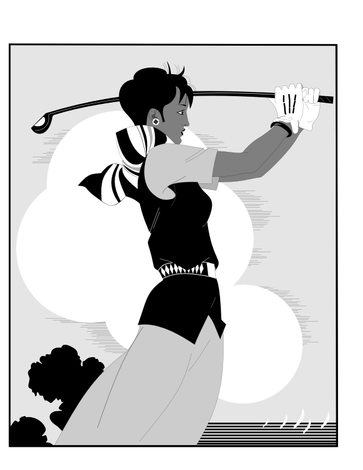

waavsps

</br>

This is an implementation of a Postscript interpreter written in C++.  The backend for the graphics rendering uses the blend2d library.

This project was inspired by a previoius Postscript interpreter I wrote using LuaJIT and blend2d: https://github.com/Wiladams/lj2ps

There was also a subset (without graphics) implemented in asim: https://github.com/Wiladams/asim

For the current implementation, 'inspired by' just means taking a lot of the learnings from the previous implementations, as the code itself is different enough that it's not an easy translation.  The goal here is to have an even smaller, faster implementation that is as portable as the underlying blend2d library.  Trying to be as feature complete as possible, as the world of Postscript files is fairly finite, and not expanding that quickly.

The list of operators involved in the Postscript language is long.  The current implementation state can mostly be found here: https://github.com/Wiladams/waavscript/blob/main/docs/registryofops.md

In general, all manner of postscript documentation, tutorials, references, and examples, are collected here.  It's a bit of a postscript shrine in that way, because it's a fading art, books are out of print, inventors pass away.  Postscript made a significant contribution to the world of print, which lasts to this day.  Preserving some of that history, creating a new implementation, gathering the samples that went before, is just fun, and informative.

Besides all that, I want a reasonable VM runtime that I can play with and expand upon.  The runtime here (a stack based machine), is fairly capable, and an alternative to embedding Javascript, Python, Lua, or others.  Purely just a 'why not' exercise.

Usage
-----
There is no 'library' as such.  No makefile, no build system in general.  It's all in header files, and you can get started by including a couple of them.  Here is an example of an application that takes a .ps file and renders it, saving to whatever blend2d format file (default .png) you specify.

```C++

#include <filesystem>
#include <memory>
#include <cstdio>
#include <string>

#include "mappedfile.h"
#include "psvmfactory.h"
#include "b2dcontext.h"


using namespace waavs;

#define CAN_WIDTH 800
#define CAN_HEIGHT 600


static void setupFonts()
{
	//loadFontDirectory("c:\\Windows\\Fonts");
}


// Utility to wrap input and run interpreter
static void runPostscript(OctetCursor input, const char *outfilename) 
{
	auto vm = PSVMFactory::createVM();

	if (!vm) {
		printf("Failed to create virtual machine\n");
		return;
	}

	auto ctx = std::make_unique<waavs::Blend2DGraphicsContext>(1700, 2200);	// US Letter size in points (8.5 x 11 inches, 200dpi)
	ctx->initGraphics();
	vm->setGraphicsContext(std::move(ctx));

	// Run the interpreter
	//PSInterpreter interp(*vm);
	vm->interpret(input);

	// If we want, we can save output here
	static_cast<waavs::Blend2DGraphicsContext*>(vm->graphics())->getImage().writeToFile(outfilename);

}

// Utility to replace .ps with .png or append .png if no .ps is found
std::string defaultOutputFilename(const std::string& inputFilename) {
	std::string output = inputFilename;
	size_t pos = output.rfind(".ps");
	if (pos != std::string::npos && pos == output.length() - 3) {
		// Found ".ps" at the end
		output.replace(pos, 3, ".png");
	}
	else {
		// No .ps suffix; just append .png
		output += ".png";
	}
	return output;
}

int main(int argc, char** argv)
{

	if (argc < 2)
	{
		printf("Usage: post2img <postscript file>  [output file]\n");
		return 1;
	}

	setupFonts();

	// create an mmap for the specified file
	const char* filename = argv[1];

	auto mapped = MappedFile::create_shared(filename);

	// if the mapped file does not exist, return
	if (mapped == nullptr)
	{
		printf("File not found: %s\n", filename);
		return 1;
	}

	OctetCursor mappedSpan(mapped->data(), mapped->size());


	auto outfilename = defaultOutputFilename(filename);

	runPostscript(mappedSpan, outfilename.c_str());

	return 0;
}
```

Everything is in the 'waavs' namespace, so 'using namespace waavs;' at the top makes it convenient to not have to refer to that everywhere else.

The renderer is fairly modular, so although it is presenting a blend2d backend, any other backend can be fairly easily plugged in.  There are only a handful of routines that are required of the backend.   Refer to the file 'b2dcontext.h' for reference if you want to change this.

Postscript has about 300 built in operators.  These can be found in the various files that beging with 'ps_opsxxx.h'.  If you want to change them or add new ones, there they are.  Just add a new header file, and register the new entries in the 'psvmfactory.h' file.

To maintain modularity and portability to various backends, none of the backend specifics creep into the operators. So, instead of calling blend2d 'setStrokeWidth' directly, an intermediary is used.

```c++
    inline bool op_setlinewidth(PSVirtualMachine& vm) {
        auto& ostk = vm.opStack();
        auto& ctm = vm.graphics()->getCTM();

        if (ostk.empty())
            return vm.error("op_setlinewidth: stackunderflow");    

        PSObject widthObj;
        ostk.pop(widthObj);

        if (!widthObj.isNumber())
            return vm.error("op_setlinewidth:typecheck; expected number");

        double width, dwidth;

        ctm.dtransform(widthObj.asReal(), 0.0, width, dwidth);

        vm.graphics()->setLineWidth(width);

        return true;
    }
```

Over time, more of the operators will begin to use the VM itself for their implementation.  That change will need to correspond with a speedup of the VM itself, or things will become really slow.

Implementation Highlights
-------------------------

First of all, the level of C++ is C++-17.  I try not to use very many of the features of the language, as that makes the code less portable.  Although iterators are widely available, for example, I try not to use them too much, even though it makes the code easier in some cases, it also complicates it.  Where possible, I try to use a simpler, more maintainable solution.  One example is traversing arrays.  It's easy to iterate over std::vector, but it's also easy to just use an index to do the same, so the index method is preferred.

I try not to expose the internal representation details.  For example, instead of exposing a dictionary's internal representation for traversal, I implement a 'forEach()' mechanism, where a function can be passed in to work with each of the elements.

Core Data Types
---------------
The PostScript language has a few core data types: bool, int, real, string, name, array, dictionary, font face, font, file, operator, path, matrix.  In addition, there are a couple of stack objects (operand, exec, graphicsstate, dictionarystack).  There is one structure in the system which acts as a variant, PSObject, located in pscore.h.  This object gets the most usage throughout the code, as it is a wrapper for all the used data types.  This needs to be as small and fast as possibly because it is passed around between all operators and functions.  
    
Note: As of 7 July 2025, this data structure needs to make some changes.  Instead of the real type being represented by a double, it should be changed to be a float, although PSMatrix should remain as double.  The PSMatrix should use a handle structure, like the larger data types such as Dictionary and Array.  The PSPath should also use a handle, so the whole data structure can be smaller.
    
Name Handling
---------------
Names are super critical in terms of usage and performance.  Here, all names are interned.  Meaning, a name value is stored once in a global table, and from then on it is represented by the pointer values.  So, the PSName object takes care of interning a name, and presenting a higher performance interface.  This is critical for using names as keys in dictionaries.  Since a name is unique in this system, the pointer to the name is the key in the dictionary.  This eliminates the need to do complicated hashing and comparison at runtime. (Note:  could use a murmur hash on the pointer values to get better distribution in PSDictTable).

Dictionaries
------------

Besides the PSObject type, the PSDictionary is the most important internal data structure in the system.  The dictionary holds all important values, and there are dictionaries of dictionaries.  This is similar to the way in which lua uses the 'table' as the basis for all complex data structures.  So, making this as small and fast as possible is paramount.

Along with name interning, the PSDictTable, and PSDictionary, implement a fairly simple and performent 'open hash' dictionary.  This eliminates the need for types such as unordered_map, or map.  I think it's an ok choice in this case because the number of items to be found in a dictionary is typically limited to a few hundred items at most, so using more complex structures that can deal with thousands, or millions, is not worth the overhead, and likely no more performant than this simple implementation.

